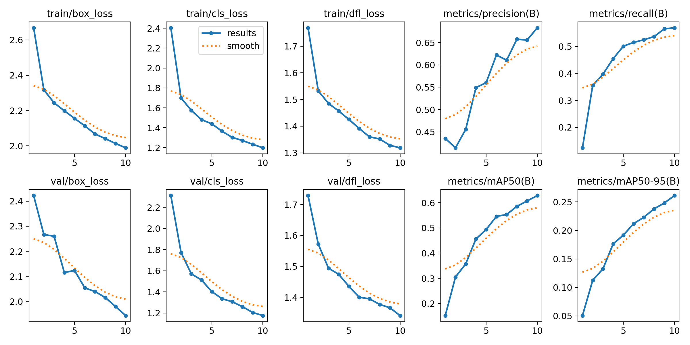

# Warehouse-YOLOv8-Object-Detection
# Autonomous Warehouse Vision: Real-Time Edge Object Detection using YOLOv8

A custom-trained deep learning computer vision system designed to detect warehouse infrastructure components (pallets, forklifts) in real-time. This project explores the feasibility of deploying object detection models on CPU-based edge environments for industrial logistics and automated guided vehicles (AGVs).

## 📊 Performance & Analytics
* **Framework:** YOLOv8 (Nano Architecture)
* **Training Platform:** 13th Gen Intel Core i5 CPU (Edge deployment test)
* **Mean Average Precision (mAP50):** 62.9%
* **Inference Speed:** 38.7ms per frame (~25 FPS - Real-time capable on standard CPU)

### Training Evaluation Curves
The model demonstrated stable convergence over the baseline training run, reducing classification loss by over 50%:

## 🛠️ Project Structure
* `train.py` - Script configuring the data pipeline, multiprocessing safeguards, and localized CPU training loop.
* `video_test.py` - Frame-by-frame inference tracking pipeline mapping bounding boxes onto dynamic warehouse mp4 video streams.
* `results.png` - Training diagnostics tracking loss functions and precision/recall metrics.
